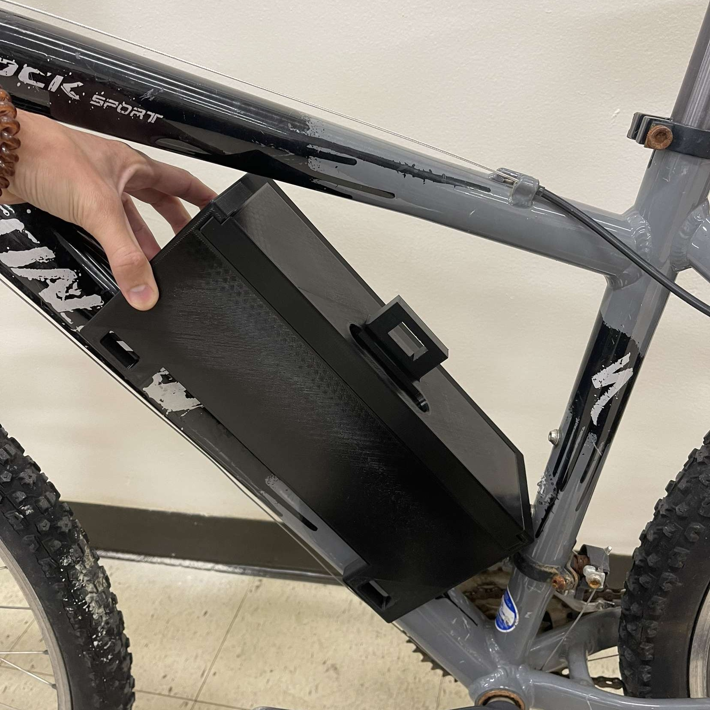

# Capstone-Portfolio

Welcome to my portfolio! This repository contains the source code for my personal portfolio website for Capstone Design's Skill Builder 2.

## Table of Contents

- [About Me](#about-me)
- [Experience](#experience)
- [Projects](#projects)
- [Usage](#usage)

## About Me

I'm Willie Hedrick Jr, a passionate computer engineer with a love for technology and innovation. I've been tinkering with computers since the age of 11, and my journey has led me through various aspects of software and hardware development.

## Experience

### Programming Languages

- **C++:** Experienced
- **C:** Experienced
- **JavaScript:** Intermediate
- **Python:** Intermediate
- **C#:** Intermediate
- **Java:** Fundamentals

### RTL Design

- **Verilog:** Experienced
- **SystemVerilog:** Intermediate
- **Vivado:** Experienced
- **TCL:** Fundamentals

## Projects

### [Pyexchange](https://github.com/WillieDLive/Pyexchange)


A project showcasing my proficiency in Python.

### [E-Zoom Hybrid Bike Kit](https://github.com/WillieDLive/capstone-centralelectronics)



A project for Capstone Design, exploring hardware and software integration for a hybrid bike kit.

## Usage

Feel free to explore the site by cloning this repository and opening the `index.html` file in your preferred web browser.

```bash
git clone https://github.com/WillieDLive/your-portfolio-repo.git
cd your-portfolio-repo
